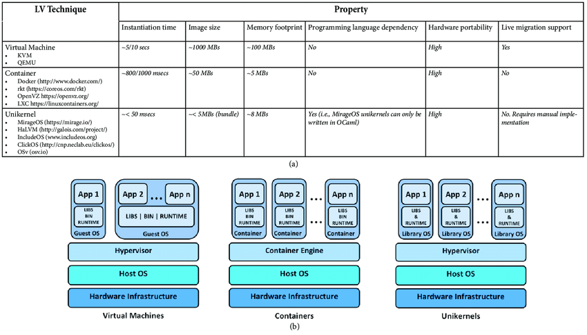

# Recipes

## [Dedicated](https://en.wikipedia.org/wiki/Operating_system)

You may have an old laptop or desktop with an outdated OS and you would like to re-purpose it.

## [Dual or multiple](https://en.wikipedia.org/wiki/Multi-booting)

Dual boot; two or more operating systems on a personal computer. You may prefer to keep existing installation *as-is* and 
add another operating system directly on the computer without affecting current set-up.  When you boot you computer the BIOS will present multiple choices of OS to boot the device

## [Virtualization](https://en.wikipedia.org/wiki/Virtualization)

Keep current set-up as is and install an operating system within a virtual machine software such as [Virtual Box](https://www.virtualbox.org/). When you boot you PC you will then need to start-up the VM software.

## [Container](https://en.wikipedia.org/wiki/OS-level_virtualization)
Keep current set-up as is and install an operating system within a container engine software such as [Docker](https://www.docker.com/). When you boot you PC you will then need to start-up the container instance(s).

## [Unikernel](https://en.wikipedia.org/wiki/Unikernel)
Keep current set-up as is and install an operating system within a unikernel engine software such as [Ling]https://erlangonxen.org/

### Diagram

For Recipes Two, Three and Four

[Source](https://www.researchgate.net/publication/320729008_Consolidate_IoT_Edge_Computing_with_Lightweight_Virtualization)

## My personal choice?
Currently (as of Dec 2019) I have chosen the Dedicated option and to re-purpose my laptop with [Ubuntu 18.0.4 LTS](http://releases.ubuntu.com/18.04/)

**Next -> [Dedicated](dedicated.md)**
